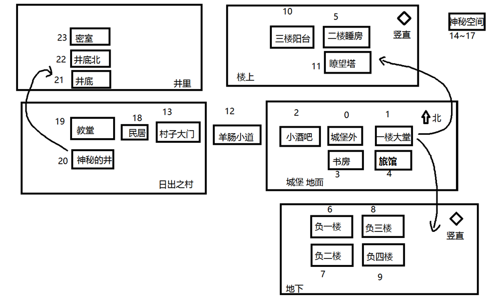

# 城堡游戏


### [Android版](https://github.com/ice1000/AIAndroid)

目前我正在使用Java继续更新这个项目，请移步[Java分支](https://github.com/ice1000/Castle-game/tree/java)


# 内容介绍

GUI版与CUI版共存。<br/>

这是主分支的release：
> [v1.0纯Java版](https://github.com/ice1000/Castle-game/releases/tag/v1.0)<br/>
[v1.2Java&Kotlin版](https://github.com/ice1000/Castle-game/releases/tag/v1.2)<br/>
[v1.2.1含jar包Java&Kotlin版](https://github.com/ice1000/Castle-game/releases/tag/v1.2.1)<br/>
Java初学者可通过此项目的v1.0对于OOP的设计模式有一个初步的了解。<br/>
v1.1展示如何使用Kotlin和Java进行简单的对接。<br/>
地图：<br/>


# 运行方法
这个必须看哦！

1. 安装jre8
1. 找到release中的压缩文件，下载并解压
1. 使用以下命令运行：``` java -jar gui.jar ``` 或者双击
1. enjoy

# 实现情况
- [X] 一个图标
- [X] 地图系统
- [X] 存档系统
- [X] 战斗系统
- [X] BOSS系统
- [X] 等级系统
- [X] ~~GUI~~封装的CUI
- [X] GUI、CUI双版本共存
- [X] 地图存储在SQLite中。
- [ ] 物品、背包系统
- [ ] NPC系统
- [ ] 与服务器端的通讯。
